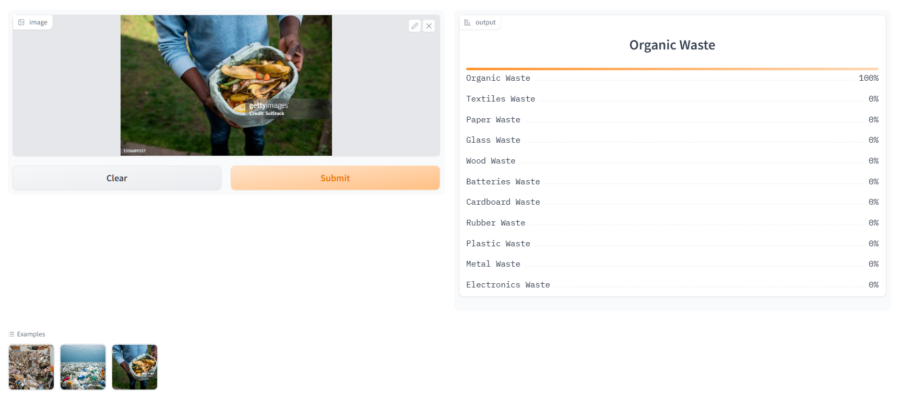

# Waste Classifier

The **Waste Classifier** is an image classification application designed to identify and categorize waste into 11 distinct types. It combines data collection, preprocessing, model training, and deployment with API integration to provide a functional and easy-to-use tool for waste management. The application has been deployed using Hugging Face Spaces and is integrated into a GitHub Pages website for seamless user interaction.

---

## Purpose

The primary purpose of this application is to facilitate waste categorization based on uploaded images. Proper classification of waste helps streamline recycling and disposal processes, promoting sustainable waste management practices. The application demonstrates a full pipeline of machine learning development, from data preparation to deployment, showcasing its scalability and practical value.

---

## Business Value

Efficient waste sorting is critical in waste management and recycling industries. This application provides value by:
- Automating the waste classification process, reducing human error.
- Enabling better resource recovery through accurate sorting.
- Serving as a prototype for industries exploring AI-based waste management solutions.
- Showcasing the potential for integrating machine learning models with accessible web-based interfaces.

---

## Functionality

The application can classify waste into the following categories:
- Organic Waste
- Textiles Waste
- Paper Waste
- Glass Waste
- Wood Waste
- Batteries Waste
- Cardboard Waste
- Rubber Waste
- Plastic Waste
- Metal Waste
- Electronics Waste

Users can upload an image of waste, and the model will predict its category with high accuracy.

---

## Dataset Preparation

### Data Collection
- Data was sourced using search queries on DuckDuckGo for each waste category.

### DataLoader
- FastAI's `DataBlock` API was utilized to create and manage the data loader for training.

### Data Augmentation
- Default FastAI data augmentation techniques were applied, leveraging GPU-based transformations for efficiency.

**Detailed implementation:** Refer to [`notebooks/data_prep.ipynb`](notebooks/data_prep.ipynb).

---

## Training and Data Cleaning

### Training
- A ResNet34 model was fine-tuned using transfer learning for three rounds of five epochs each.
- Achieved an accuracy of approximately 84% after multiple iterations of training.

### Data Cleaning
- A significant effort was spent cleaning the dataset due to noise from web-scraped images.
- FastAI’s `ImageClassifierCleaner` was used to refine the dataset after each training phase, ensuring consistent improvements in accuracy and performance.

---

## Model Deployment

The trained model was deployed using Hugging Face Spaces and integrated with a Gradio web interface for user interaction. The deployment enables users to upload images and receive predictions in real time.

- Deployment details and implementation can be found in the `deployment` folder.
- The deployed Gradio app is accessible [here](https://huggingface.co/spaces/mushfiq-shanto/waste_classifier).  
- Example of the Gradio app interface:

---

## API Integration with GitHub Pages

The application’s functionality is extended through integration with a GitHub Pages website, providing a user-friendly interface to access the classification API.

- **GitHub Pages Integration:** [Waste Classifier Application]([https://mushfiq-shanto.github.io/waste_classifier/](https://mushfiq-shanto.github.io/Waste-Category-Classification-Model/))
- **Implementation Details:** Refer to the `docs` folder.

This seamless integration demonstrates how machine learning models can be embedded into static websites to deliver real-time results.

---

## Folder Structure

- **`notebooks/`**: Contains the Jupyter Notebook for data preparation and training (`data_prep.ipynb`).
- **`deployment/`**: Includes deployment scripts and resources for Gradio app integration.
- **`docs/`**: Holds the source files for the GitHub Pages website, including HTML and JavaScript for API integration.

---

## Conclusion

The Waste Classifier is a complete end-to-end machine learning solution for waste categorization. Its robust pipeline, from data collection to web-based deployment, demonstrates the practical application of AI in solving real-world problems. The application is designed to be extendable and serves as a strong foundation for further research and development in waste management systems.
